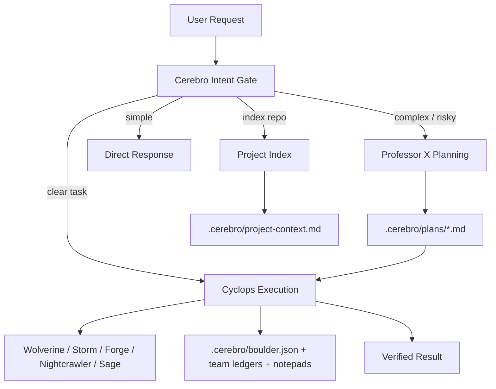

# Cerebro Agentic Workflow

This is the operational workflow for the OpenCode-native Cerebro runtime.

## Runtime Architecture

## Commands

| Command | Purpose |
|---|---|
| `/to-me-my-x-men [task]` | Autonomous execution for clear tasks; asks before using Cerebro's own judgment on unclear product-shaped prompts. |
| `/cerebro-index` | Build or refresh repository context. |
| `/cerebro-plan [task]` | Interview-first planning with Professor X. |
| `/cerebro-start-work` | Execute or resume the latest Cerebro plan. |
| `/cerebro-doctor` | Validate command names, model routing, OpenCode agents/commands, plugin bridge, schemas, and runtime health. |
| `/cerebro-reset` | Scan and reset generated Cerebro runtime state after explicit confirmation. |

## State Files

| Path | Owner | Purpose |
|---|---|---|
| `.cerebro/schemas/boulder.schema.json` | Cyclops | Required shape for resumable execution state. |
| `.cerebro/scripts/check-agent-teams-enabled.py` | Cerebro | Legacy compatibility check for Claude Code agent-team settings; not part of the active OpenCode runtime. |
| `.cerebro/scripts/reset-runtime.py` | Cerebro | Reusable scan/reset/verify helper for `/cerebro-reset`. |
| `.cerebro/scripts/setup-status.py` | Cerebro | Reusable installation status helper. |
| `.cerebro/scripts/test-stop-hook.py` | Cerebro | Legacy compatibility check for Claude Stop-hook blocking behavior; active OpenCode runs use `cerebro_verify_pending`. |
| `.cerebro/scripts/validate-agent-frontmatter.py` | Cerebro | Reusable doctor check for OpenCode agent frontmatter. |
| `.cerebro/scripts/validate-opencode-runtime.py` | Cerebro | Authoritative OpenCode runtime validator for config, plugin bridge, commands, agents, and model routing. |
| `.cerebro/scripts/validate-boulder.py` | Cerebro | Reusable doctor check for `.cerebro/boulder.json`. |
| `.cerebro/scripts/validate-team-runs.py` | Cerebro | Reusable doctor check for the team-run template and manifests. |
| `.cerebro/templates/plan.md` | Professor X | Canonical plan schema. |
| `.cerebro/templates/project-context.md` | Cerebro | Canonical repository index schema. |
| `.cerebro/project-context.md` | Cerebro | Indexed stack, commands, conventions, entrypoints, and risks. |
| `.cerebro/plans/*.md` | Professor X | Approved implementation plans. |
| `.cerebro/boulder.json` | Cerebro | Business-level execution checkpoint: active plan, overall status, approvals, verification history, and decisions. Task progress lives in `.cerebro/team-runs/{run-id}.tasks.json`. |
| `.cerebro/team-runs/{run-id}.json` | Cerebro | Run manifest for command, team name, teammates, approvals, mailbox decisions, verification, and cleanup. |
| `.cerebro/team-runs/{run-id}.tasks.json` | Cyclops | OpenCode-managed task ledger updated by `cerebro_task_create/list/update`. |
| `.cerebro/team-runs/{run-id}.mailbox.jsonl` | Cerebro team | Mailbox log written by `cerebro_mailbox_send` and read by `cerebro_mailbox_read`. |
| `.cerebro/team-runs/{run-id}.checkpoints.jsonl` | Cerebro team | Durable checkpoints written by `cerebro_checkpoint`. |
| `.cerebro/notepads/{plan}/conventions.md` | Cyclops | Coding patterns, naming, file structure, UI patterns. |
| `.cerebro/notepads/{plan}/commands.md` | Cyclops | Useful install/test/lint/build/dev commands. |
| `.cerebro/notepads/{plan}/decisions.md` | Cyclops | Approval decisions and architectural decisions. |
| `.cerebro/notepads/{plan}/gotchas.md` | Cyclops | Subtle traps, edge cases, unexpected behavior. |
| `.cerebro/notepads/{plan}/failures.md` | Cyclops | Failed approaches and why. |
| `.cerebro/notepads/{plan}/verification.md` | Cyclops | Verification commands and outcomes. |
| `.cerebro/notepads/{plan}/issues.md` | Cyclops | Blockers, deferred work, unresolved risks. |
| `.cerebro/pending-todos/{team}/{agent}/{task-id}.txt` | Wolverine / Storm | Task-scoped worker todos checked by `cerebro_verify_pending`. |
| `.cerebro/.pending-todos` | Wolverine / Storm | Legacy worker todo file kept for backward compatibility with old runs. |
| `.cerebro/auto-upgrade.json` | Cerebro | Last npm package version check / best-effort auto-upgrade result written on plugin load. |

## Package Auto-Upgrades

Open X-Men is package-managed, not template-synced. When the plugin loads, it checks npm for the latest `open-xmen` package version. If a newer version is available and the plugin is running from a package-managed install, it updates the package and reruns `open-xmen install --reset --no-deps` against the current project so managed runtime files refresh while user-owned state remains intact.

### How It Works

1. Read the current package version from the loaded `open-xmen` package.
2. Query `npm view open-xmen version`.
3. If latest is newer, run `npm install open-xmen@<latest> --ignore-scripts` in the package-manager root when available.
4. Run `open-xmen install --reset --no-deps --dir <project>` to refresh managed runtime files.
5. Write `.cerebro/auto-upgrade.json` with `current`, `upgraded`, `skipped`, `unavailable`, or `failed` status.

Set `OPEN_XMEN_SKIP_AUTO_UPGRADE=1` or `OPEN_XMEN_AUTO_UPGRADE=0` to disable the load-time check.

## Skills

Skills are optional overlays. They may improve task-specific execution or verification, but the base workflow must continue without them. `.cerebro` contracts, approval gates, and result envelopes stay authoritative when a skill gives conflicting advice.
